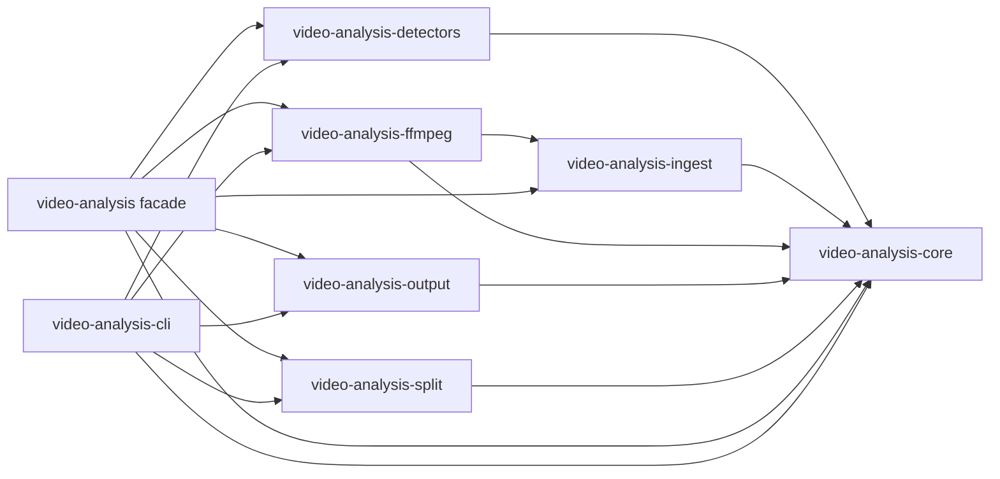

# Rust Video Analysis Packages

This workspace contains a Rust-first reimplementation of PySceneDetect-style video scene analysis.
The vendored `references/pyscenedetect` directory is used only as an upstream behavior reference.

## Crates

- `video-analysis`: umbrella re-export crate.
- `video-analysis-core`: timecodes, video/audio/text sample types, metrics, analyzer traits, observations, and realtime pipelines.
- `video-analysis-detectors`: content, adaptive, threshold, histogram, and perceptual hash detectors.
- `video-analysis-ingest`: media ingest traits plus live/file text sources.
- `video-analysis-ffmpeg`: FFmpeg-backed video and audio ingest implementations.
- `video-analysis-output`: scene/stats CSV and simple HTML output helpers.
- `video-analysis-split`: ffmpeg CLI based scene splitting.
- `video-analysis-cli`: `vanalyze` command-line tool.

## Dependency Graph

`video-analysis-core` is the foundational crate for shared contracts and pipeline
orchestration. Functional crates depend on `core`, but not on each other.
Composition happens in `video-analysis-cli` and the root `video-analysis` facade
crate.



## Functional Pipelines

### Video Detection

```text
video-analysis-ffmpeg
  -> video-analysis-ingest::VideoFrameSource / MediaSource
  -> video-analysis-core::OwnedVideoFrame
  -> video-analysis-core::ScenePipeline
  -> video-analysis-detectors::SceneDetector impls
  -> video-analysis-core::DetectionResult
```

- `video-analysis-ffmpeg` decodes/probes input videos and yields video frames.
- `video-analysis-ingest` defines file/live source traits for video, audio, and
  text.
- `video-analysis-core` owns video/audio/text sample types, time, scene, result,
  observation, analyzer trait, and pipeline orchestration contracts.
- `video-analysis-detectors` implements scene detector algorithms.
- `video-analysis-cli` wires the source, detector choice, and pipeline execution.

### Realtime Ingest

`ScenePipeline` supports both batch and incremental processing:

```rust
use video_analysis_core::{Result, ScenePipeline};
use video_analysis_detectors::ContentDetector;
use video_analysis_ffmpeg::FfmpegVideoSource;
use video_analysis_ingest::VideoFrameSource;

fn main() -> Result<()> {
    let mut source = FfmpegVideoSource::open_live("rtsp://camera.example/stream")?;
    let mut pipeline = ScenePipeline::builder()
        .detector(ContentDetector::default())
        .start_in_scene(true)
        .build()?;

    while let Some(frame) = source.next_video_frame()? {
        let analysis = pipeline.process_frame(frame)?;
        for cut in analysis.cuts {
            println!("cut at {:.3}s", cut.position.timestamp.seconds());
        }
    }

    let _final_result = pipeline.finish_detection()?;
    Ok(())
}
```

For recorded sources, `ScenePipeline::detect(&mut source)` remains available.
For realtime sources, call `process_frame()` as frames arrive and only call
`finish_detection()` when the stream ends or the application shuts down.

### Realtime Video Enrichment

Scene detection and frame-level enrichment can run in one pass over a live
video stream. OCR, face recognition, object detection, and similar integrations
implement `VideoAnalyzer` and emit structured `Observation` values.

```rust
use video_analysis_core::{Observation, ObservationKind, RealtimeVideoPipeline, Result, VideoAnalyzer, VideoFrame};
use video_analysis_detectors::ContentDetector;
use video_analysis_ffmpeg::FfmpegVideoSource;
use video_analysis_ingest::VideoFrameSource;

struct OcrAnalyzer;

impl VideoAnalyzer for OcrAnalyzer {
    fn name(&self) -> &'static str {
        "ocr"
    }

    fn process_frame(&mut self, frame: &VideoFrame<'_>) -> Result<Vec<Observation>> {
        let _ = frame;
        Ok(vec![Observation::new(self.name(), ObservationKind::Text)
            .text("detected text")
            .score(0.95)])
    }
}

fn main() -> Result<()> {
    let mut source = FfmpegVideoSource::open_live("rtsp://camera.example/stream")?;
    let mut pipeline = RealtimeVideoPipeline::builder()
        .scene_detector(ContentDetector::default())
        .video_analyzer(OcrAnalyzer)
        .start_in_scene(true)
        .build()?;

    while let Some(frame) = source.next_video_frame()? {
        let analysis = pipeline.process_frame(frame)?;

        for observation in analysis.observations {
            println!("scene {:?}: {:?}", observation.scene_index, observation.kind);
        }

        for scene in analysis.completed_scenes {
            println!(
                "closed scene {} with {} observations",
                scene.scene_index,
                scene.observations.len()
            );
        }
    }

    let result = pipeline.finish_analysis()?;
    println!("{} scenes, {} observations", result.scenes.len(), result.observations.len());
    Ok(())
}
```

`RealtimeVideoPipeline` decodes each frame once, feeds the borrowed frame to
scene detectors and video analyzers, annotates observations with the active
scene index, and emits a `SceneAnalysis` as soon as a scene closes. Downstream
components can consume either frame events immediately or complete per-scene
batches. OCR observations can also be converted to `OwnedTextSegment` with
`Observation::to_text_segment(...)` when a text pipeline should process detected
on-screen text.

### Audio Analysis

Audio follows the same shape: the FFmpeg crate decodes, the ingest trait yields
chunks, and `AudioPipeline` analyzes each chunk as it arrives.

```rust
use video_analysis_core::{AudioPipeline, Result};
use video_analysis_ffmpeg::FfmpegAudioSource;
use video_analysis_ingest::AudioFrameSource;

fn main() -> Result<()> {
    let mut source = FfmpegAudioSource::open_live("rtsp://camera.example/stream")?;
    let mut pipeline = AudioPipeline::builder()
        .analyzer(my_audio_analyzer())
        .build()?;

    while let Some(frame) = source.next_audio_frame()? {
        let analysis = pipeline.process_frame(frame)?;
        for event in analysis.events {
            println!("{:?} {}", event.timestamp, event.label);
        }
    }

    let _final_result = pipeline.finish_analysis()?;
    Ok(())
}
```

Audio analyzers implement `video_analysis_core::AudioAnalyzer` and receive
borrowed `AudioFrame` values. `FfmpegAudioSource` emits `f32` PCM chunks by
default, with configurable samples per chunk.

### Text Analysis

Text ingest is line/segment oriented so transcripts, subtitles, logs, or live
ASR output can be analyzed incrementally.

```rust
use video_analysis_core::{Result, TextPipeline};
use video_analysis_ingest::{TextLineSource, TextSegmentSource};

fn main() -> Result<()> {
    let mut source = TextLineSource::open("transcript.txt")?;
    let mut pipeline = TextPipeline::builder()
        .analyzer(my_text_analyzer())
        .build()?;

    while let Some(segment) = source.next_text_segment()? {
        let analysis = pipeline.process_segment(segment)?;
        for event in analysis.events {
            println!("segment {} {}", analysis.segment_index, event.label);
        }
    }

    let _final_result = pipeline.finish_analysis()?;
    Ok(())
}
```

Text analyzers implement `video_analysis_core::TextAnalyzer`. For live text,
wrap any blocking `BufRead` with `TextLineSource::live(...)`.

### Output

```text
DetectionResult
  -> video-analysis-output
  -> CSV / HTML / stdout / file writers
```

- `video-analysis-output` serializes `Scene`, `MetricsStore`, and
  `DetectionResult`.
- It must not know about FFmpeg, CLI options, or detector implementations.

### Split

```text
DetectionResult.scenes
  -> video-analysis-split
  -> ffmpeg CLI scene files
```

- `video-analysis-split` consumes only `Scene` values and splits the original
  media.
- It does not perform detection or own detector/source selection.

### CLI

```text
CLI args
  -> source construction
  -> detector construction
  -> ScenePipeline::detect
  -> output or split action
```

- `video-analysis-cli` composes all runtime pieces.
- The CLI owns command selection, argument mapping, and workflow branching.

## Dependency Rules

Allowed internal dependencies:

- `video-analysis-core`: external utility crates only.
- `video-analysis-detectors` -> `video-analysis-core`.
- `video-analysis-ingest` -> `video-analysis-core`.
- `video-analysis-ffmpeg` -> `video-analysis-core`, `video-analysis-ingest`.
- `video-analysis-output` -> `video-analysis-core`.
- `video-analysis-split` -> `video-analysis-core`.
- `video-analysis-cli` -> crates it composes for CLI workflows.
- `video-analysis` root facade -> all library crates except CLI.

Forbidden internal dependencies:

- `video-analysis-core` must not depend on any workspace crate.
- `video-analysis-detectors` must not depend on FFmpeg, output, split, CLI, or
  facade crates.
- `video-analysis-ingest` must not depend on detectors, FFmpeg, output, split,
  CLI, or facade crates.
- `video-analysis-ffmpeg` must not depend on detectors, output, split, CLI, or
  facade crates.
- `video-analysis-output` must not depend on detectors, FFmpeg, split, CLI, or
  facade crates.
- `video-analysis-split` must not depend on detectors, FFmpeg crate, output,
  CLI, or facade crates.
- No library crate should depend on `video-analysis-cli`.

## Example

```bash
cargo run -p video-analysis-cli -- detect --input video.mp4 --detector content --output scenes.csv --stats stats.csv
cargo run -p video-analysis-cli -- list --input video.mp4 --detector adaptive
cargo run -p video-analysis-cli -- split --input video.mp4 --detector content --output-dir scenes
```

The default test suite does not require FFmpeg to be installed.
