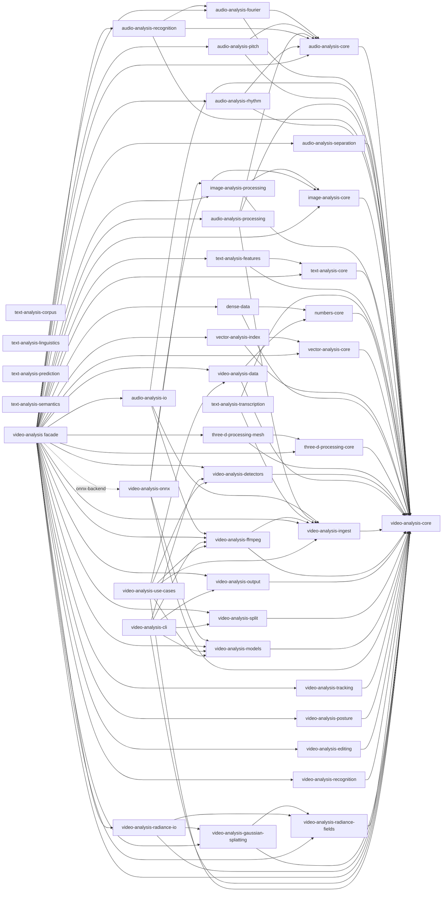

# Rust Multimodal Analysis Packages

This workspace contains Rust-first crates for video, audio, image, text, vector,
and 3D analysis/processing. The scene detection packages started as a
PySceneDetect-style video analysis implementation; the vendored
`references/pyscenedetect` directory is used only as an upstream behavior
reference.

See [CONTRIBUTING.md](CONTRIBUTING.md) for local verification and tool setup,
[SECURITY.md](SECURITY.md) for vulnerability reporting, and the root
[LICENSE-MIT](LICENSE-MIT) / [LICENSE-APACHE](LICENSE-APACHE) files for the
workspace licensing terms.

## Crates

Rust crates are grouped under `crates/` by input or integration domain:
`audio/`, `video/`, `image/`, `text/`, `vector/`, `data/`, `math/`,
`three-d/`, and `comfyui/`.

Package README index:

- Root facade: [`video-analysis`](src/lib.rs), [README](README.md)
- Audio: [`audio-analysis-core`](crates/audio/audio-analysis-core/README.md), [`audio-analysis-fourier`](crates/audio/audio-analysis-fourier/README.md), [`audio-analysis-io`](crates/audio/audio-analysis-io/README.md), [`audio-analysis-pitch`](crates/audio/audio-analysis-pitch/README.md), [`audio-analysis-processing`](crates/audio/audio-analysis-processing/README.md), [`audio-analysis-recognition`](crates/audio/audio-analysis-recognition/README.md), [`audio-analysis-rhythm`](crates/audio/audio-analysis-rhythm/README.md), [`audio-analysis-separation`](crates/audio/audio-analysis-separation/README.md), [`audio-analysis-synthesis`](crates/audio/audio-analysis-synthesis/README.md)
- ComfyUI: [`comfyui-data`](crates/comfyui/comfyui-data/README.md), [`comfyui-latents`](crates/comfyui/comfyui-latents/README.md), [`comfyui-models`](crates/comfyui/comfyui-models/README.md)
- Data: [`data-inversion-core`](crates/data/data-inversion-core/README.md), [`graph-analysis-core`](crates/data/graph-analysis-core/README.md), [`numbers-core`](crates/data/numbers-core/README.md), [`tensor-data`](crates/data/tensor-data/README.md), [`dense-data`](crates/data/dense-data/README.md)
- Math: [`math-geometry-2d`](crates/math/math-geometry-2d/README.md), [`math-linear`](crates/math/math-linear/README.md), [`math-signal-core`](crates/math/math-signal-core/README.md), [`math-sparse-data`](crates/math/math-sparse-data/README.md), [`math-statistics`](crates/math/math-statistics/README.md)
- Image: [`image-analysis-comfyui`](crates/image/image-analysis-comfyui/README.md), [`image-analysis-core`](crates/image/image-analysis-core/README.md), [`image-analysis-detection`](crates/image/image-analysis-detection/README.md), [`image-analysis-io`](crates/image/image-analysis-io/README.md), [`image-analysis-models`](crates/image/image-analysis-models/README.md), [`image-analysis-onnx`](crates/image/image-analysis-onnx/README.md), [`image-analysis-processing`](crates/image/image-analysis-processing/README.md), [`image-analysis-segmentation`](crates/image/image-analysis-segmentation/README.md), [`image-analysis-synthesis`](crates/image/image-analysis-synthesis/README.md)
- Text: [`text-analysis-core`](crates/text/text-analysis-core/README.md), [`text-analysis-corpus`](crates/text/text-analysis-corpus/README.md), [`text-analysis-features`](crates/text/text-analysis-features/README.md), [`text-analysis-linguistics`](crates/text/text-analysis-linguistics/README.md), [`text-analysis-models`](crates/text/text-analysis-models/README.md), [`text-analysis-prediction`](crates/text/text-analysis-prediction/README.md), [`text-analysis-retrieval`](crates/text/text-analysis-retrieval/README.md), [`text-analysis-retrieval-storage`](crates/text/text-analysis-retrieval-storage/README.md), [`text-analysis-semantics`](crates/text/text-analysis-semantics/README.md), [`text-analysis-synthesis`](crates/text/text-analysis-synthesis/README.md), [`text-analysis-transcription`](crates/text/text-analysis-transcription/README.md)
- Vector and 3D: [`vector-analysis-core`](crates/vector/vector-analysis-core/README.md), [`vector-analysis-index`](crates/vector/vector-analysis-index/README.md), [`three-d-processing-core`](crates/three-d/three-d-processing-core/README.md), [`three-d-processing-io`](crates/three-d/three-d-processing-io/README.md), [`three-d-processing-mesh`](crates/three-d/three-d-processing-mesh/README.md)
- Video: [`video-analysis-core`](crates/video/video-analysis-core/README.md), [`video-analysis-data`](crates/video/video-analysis-data/README.md), [`video-analysis-dataset`](crates/video/video-analysis-dataset/README.md), [`video-analysis-detectors`](crates/video/video-analysis-detectors/README.md), [`video-analysis-editing`](crates/video/video-analysis-editing/README.md), [`video-analysis-features`](crates/video/video-analysis-features/README.md), [`video-analysis-ffmpeg`](crates/video/video-analysis-ffmpeg/README.md), [`video-analysis-gaussian-splatting`](crates/video/video-analysis-gaussian-splatting/README.md), [`video-analysis-ingest`](crates/video/video-analysis-ingest/README.md), [`video-analysis-models`](crates/video/video-analysis-models/README.md), [`video-analysis-onnx`](crates/video/video-analysis-onnx/README.md), [`video-analysis-output`](crates/video/video-analysis-output/README.md), [`video-analysis-posture`](crates/video/video-analysis-posture/README.md), [`video-analysis-posture-io`](crates/video/video-analysis-posture-io/README.md), [`video-analysis-radiance-fields`](crates/video/video-analysis-radiance-fields/README.md), [`video-analysis-radiance-io`](crates/video/video-analysis-radiance-io/README.md), [`video-analysis-radiance-pipeline`](crates/video/video-analysis-radiance-pipeline/README.md), [`video-analysis-recognition`](crates/video/video-analysis-recognition/README.md), [`video-analysis-reconstruction`](crates/video/video-analysis-reconstruction/README.md), [`video-analysis-segmentation`](crates/video/video-analysis-segmentation/README.md), [`video-analysis-split`](crates/video/video-analysis-split/README.md), [`video-analysis-storage`](crates/video/video-analysis-storage/README.md), [`video-analysis-synthesis`](crates/video/video-analysis-synthesis/README.md), [`video-analysis-tracking`](crates/video/video-analysis-tracking/README.md), [`video-analysis-transform`](crates/video/video-analysis-transform/README.md), [`video-analysis-cli`](crates/video/video-analysis-cli/README.md)
- Prototypes: [`video-analysis-use-cases`](prototypes/rust/video-analysis-use-cases/README.md), `@video-analysis/web` in `prototypes/web/video-analysis-web`

- `video-analysis`: umbrella re-export crate.
- `comfyui-data`: serde contracts and helpers for ComfyUI workflow JSON and
  API prompt graphs, plus typed socket inventory helpers.
- `comfyui-latents`: ComfyUI-oriented latent batches, latent masks, and
  latent/image size helpers built on `tensor-data`.
- `comfyui-models`: ComfyUI model folder keys, default paths, inventory
  scanning, runtime-facing model references, and `extra_model_paths.yaml`
  generation helpers.
- `data-inversion-core`: shared trace metadata for lossy inverse conversions,
  including fidelity, confidence, assumptions, and interpolation notes.
- `graph-analysis-core`: deterministic graph and tree primitives for cycle
  detection, connected-component analysis, shortest paths, spanning trees, and
  tree validation.
- `numbers-core`: scalar numeric summaries, weighted running stats, quantiles,
  histograms, and range helpers for analytics and reporting crates.
- `tensor-data`: finite `f32` tensor shapes, borrowed/owned tensor values, and
  lightweight tensor metadata for interop contracts.
- `math-geometry-2d`: shared checked 2D points, rectangles, normalized
  coordinates, polygons, bounds, and affine transforms for image, video, and
  posture workflows.
- `math-linear`: dense matrix shapes, row/column views, matrix multiply,
  tensor/vector bridges, and shared 1D/2D kernel contracts.
- `math-signal-core`: sample-rate, window, resampling, frame-stride, FIR, and
  biquad design contracts for audio and time-series workflows.
- `math-sparse-data`: sparse vectors plus COO/CSR matrices for text, retrieval,
  and feature indexing workflows.
- `math-statistics`: streaming covariance, normalizers, covariance matrices,
  and PCA-lite utilities for dense multivariate inputs.
- `audio-analysis-core`: normalized audio sample conversion, mono mixing,
  windowing, frame iteration, streaming frame windows, waveform batches, and
  level helpers for audio analysis crates.
- `audio-analysis-fourier`: FFT, STFT/spectrogram, spectral features, and a
  dominant-frequency audio analyzer.
- `audio-analysis-io`: audio-named input conveniences over the FFmpeg-backed
  audio source and shared ingest traits.
- `audio-analysis-pitch`: autocorrelation pitch estimation and an audio
  analyzer that emits pitch events.
- `audio-analysis-processing`: realtime-safe audio frame transforms, including
  gain, clipping, mono conversion, DC blocking, biquad filters, noise gates, and
  processed audio sources.
- `audio-analysis-recognition`: deterministic spectral audio embeddings,
  sample-backed reference libraries, similarity search, and recognition events.
- `audio-analysis-rhythm`: onset detection, tempo estimation, and a rhythm
  analyzer that emits onset and BPM events.
- `audio-analysis-separation`: typed HTDemucs/Demucs integration for vocal and
  instrument stem separation through the external `demucs` CLI, including
  model-aware output discovery.
- `audio-analysis-synthesis`: deterministic tone, onset, and pitch-event audio
  synthesis into core audio frames with inversion trace metadata.
- `image-analysis-comfyui`: ComfyUI workflow builders for text-to-image,
  image-to-image, inpaint, and upscale image-generation flows.
- `image-analysis-core`: borrowed/owned image views, image batches, RGB/BGR/gray
  pixel contracts, compacting, mean color, luma histograms, and mask tensor
  bridges.
- `image-analysis-io`: PNG/JPEG/WebP loading and saving for compact
  `OwnedImage` buffers.
- `image-analysis-models`: image-specific model presets plus classification,
  embedding, captioning, and model-backed segmentation backend traits.
- `image-analysis-onnx`: still-image ONNX preprocessing, bundle validation,
  fake-runner seams, and optional native object-detection execution.
- `image-analysis-processing`: deterministic CPU image crop, resize, grayscale,
  inversion, thresholding, and 3x3 convolution pipelines.
- `image-analysis-segmentation`: prompt, binary-mask, and image-segment
  contracts with explicit opt-in automatic mask generation defaults.
- `image-analysis-synthesis`: deterministic solid, gradient, histogram, and
  region-based image synthesis into owned image buffers.
- `text-analysis-corpus`: corpus-scale term indexing, corpus statistics,
  TF-IDF scoring, BM25 ranking, and corpus search without retaining source text.
- `text-analysis-core`: text document contracts, text segment bridging,
  normalization, Unicode-safe tokens/graphemes/word segments with spans,
  sentence/paragraph splitting, script profiling, and text statistics.
- `text-analysis-features`: stop words, keywords, stemming, extractive
  summaries, lexicon sentiment, rule entities, readability, pattern events,
  reusable text analyzers, term frequencies, and character/token n-grams.
- `text-analysis-linguistics`: heuristic-first language detection, tokenizer
  routing, token/subword alignment, lemmatization, morphology, POS tagging,
  chunking, dependency parsing, typed entities, coreference, events, discourse,
  topics, style profiles, and a `TextAnalyzer` adapter.
- `text-analysis-models`: optional tokenizer, ONNX, and Candle adapters for
  model-backed text classification and embeddings. Default builds stay light;
  `onnx`, `candle`, `external-tests`, and `slow-external-tests` are opt-in
  features.
- `text-analysis-prediction`: deterministic token Markov chains for next-token
  prediction, generation, and perplexity scoring.
- `text-analysis-retrieval`: library-first document chunking, semantic/vector
  search, BM25 lexical search, hybrid ranking, metadata filtering, and
  related-content lookup.
- `text-analysis-retrieval-storage`: manifest, chunk, vector, and corpus
  persistence helpers for saving and reloading retrieval indexes.
- `text-analysis-semantics`: lightweight hashed text embeddings, a
  `TextEmbeddingBackend` trait, generic embedding search, text similarity, and
  co-occurrence/related-term analysis.
- `text-analysis-synthesis`: deterministic text generation from weighted terms
  and analyzer events with explicit heuristic trace metadata.
- `text-analysis-transcription`: transcript segment models, Whisper JSON,
  SRT/WebVTT/plain text parsing, command transcribers, and text segment source
  adapters.
- `vector-analysis-core`: dense vector validation, normalization, metrics,
  distances, means, and per-dimension summary statistics.
- `vector-analysis-index`: exact in-memory vector search and nearest-centroid
  assignment helpers.
- `dense-data`: dense numeric point datasets with weighted averages,
  per-dimension summaries, fixed-grid buckets, bounds, and deterministic
  k-means clustering for tables, graphs, charts, maps, and media-derived
  features.
- `three-d-processing-core`: 3D points, vectors, quaternions, rigid transforms,
  line segments, point clouds, voxel downsampling, and normalization helpers.
- `three-d-processing-io`: `OBJ`, `PLY`, and minimal embedded `.gltf`
  round-tripping for triangle meshes and point clouds.
- `three-d-processing-mesh`: triangle mesh validation, topology, normals,
  surface area, volume, deterministic sampling, transforms, and smoothing.
- `video-analysis-core`: timecodes, video/audio/text sample types, metrics, analyzer traits, observations, and realtime pipelines.
- `video-analysis-data`: stream record normalization plus online aggregation and
  bucketing for video, audio, text, numeric, and vector data.
- `video-analysis-dataset`: retained, serializable analysis records for scenes,
  frames, observations, events, metrics, tracks, features, and structured 2D
  and 3D posture records.
- `video-analysis-transform`: deterministic filtering, windowing, scene
  grouping, temporal/frame joins, dedupe, merge, and numeric resampling over
  retained dataset records.
- `video-analysis-features`: reusable feature extractors for scene stats, label
  histograms, transcripts, audio events, tracks, and vector means.
- `video-analysis-storage`: JSON, JSONL, and manifest persistence for retained
  analysis datasets.
- `video-analysis-synthesis`: deterministic storyboard/video-frame synthesis
  from frame specs and observations.
- `video-analysis-detectors`: content, adaptive, threshold, histogram, and perceptual hash detectors.
- `video-analysis-editing`: CPU frame editing primitives for cropping,
  blurring, grayscale, inversion, brightness/contrast, and 3x3 filters.
- `video-analysis-ingest`: media ingest traits plus live/file text sources.
- `video-analysis-ffmpeg`: FFmpeg-backed video and audio ingest implementations.
- `video-analysis-models`: Hugging Face model downloads plus normalized model
  adapter contracts for object, scene, and text/semantic analyzers, including
  ONNX-friendly Xenova text presets.
- `video-analysis-onnx`: ONNX object-detection and posture bundle validation,
  preprocessing, fake-runner seams, and optional native runtime adapters.
- `video-analysis-tracking`: IoU-based object tracking contracts and a
  `VideoAnalyzer` adapter that emits tracked object observations.
- `video-analysis-posture`: 2D/3D pose contracts, COCO-17 skeleton helpers,
  joint-angle and bone-length math, stick figures, posture lifting contracts,
  and a posture analyzer adapter.
- `video-analysis-posture-io`: COCO-style posture JSON plus `.ply` and `.gltf`
  export for 3D stick figures.
- `video-analysis-recognition`: reference-embedding matching for face/object
  recognition, including temporal track aggregation and analyzer adapters.
- `video-analysis-radiance-fields`: camera, ray, grid, and volume rendering
  contracts for radiance-field style scene representations.
- `video-analysis-gaussian-splatting`: 3D Gaussian primitive validation,
  projection, sorting, and CPU compositing helpers for Gaussian splatting.
- `video-analysis-radiance-io`: COLMAP text, Nerfstudio transforms, and
  GraphDeco/Nerfstudio Gaussian splat PLY import/export helpers.
- `video-analysis-radiance-pipeline`: library-first loading, validation,
  summary, and CPU preview rendering across the radiance crates.
- `video-analysis-output`: scene/stats CSV and simple HTML output helpers.
- `video-analysis-split`: ffmpeg CLI based scene splitting.
- `video-analysis-cli`: `vanalyze` command-line tool.
- `video-analysis-use-cases`: prototype runnable end-to-end use-case pipelines.
- `@video-analysis/ui`: React + TailwindCSS component packs for viewing
  analysis results in an application UI.
- `@video-analysis/web`: prototype Vite app for trying workflows, reports, and
  package integrations locally.

## Repository Layout

- `crates/`: reusable Rust packages intended to stay focused and composable.
- `packages/`: reusable frontend packages such as `@video-analysis/ui`.
- `prototypes/`: executable experiments and testbeds, including use-case
  workflows, the local web app, and future search/recommendation prototypes.

## Frontend Component Packs

The `packages/video-analysis-ui` npm package mirrors the Rust package
boundaries with subpath exports:

- `@video-analysis/ui/core`: scene timelines, scene tables, observations,
  audio/text events, and video summary cards.
- `@video-analysis/ui/cli`: command status, arguments, and generated output
  file summaries for `vanalyze` workflows.
- `@video-analysis/ui/data`: bucket and stream summary views.
- `@video-analysis/ui/detectors`: detection and cut summary views.
- `@video-analysis/ui/ffmpeg`: media metadata panels.
- `@video-analysis/ui/ingest`: source and asset summaries.
- `@video-analysis/ui/models`: capability and scored model observation views.
- `@video-analysis/ui/output`: report shell and JSON report loader.
- `@video-analysis/ui/split`: scene split plan preview.
- `@video-analysis/ui/use-cases`: composed dashboards, including
  `YoutubeVideoReportView` for the YouTube video use-case JSON report.
- `@video-analysis/ui`: the root facade that re-exports all frontend packs.

```tsx
import { YoutubeVideoReportView } from "@video-analysis/ui/use-cases";
import type { YoutubeVideoReport } from "@video-analysis/ui";

export function ReportPage({ report }: { report: YoutubeVideoReport }) {
  return <YoutubeVideoReportView report={report} />;
}
```

Add the package output to Tailwind's content list:

```js
import videoAnalysisContent from "@video-analysis/ui/tailwind-content";

export default {
  content: ["./src/**/*.{ts,tsx}", ...videoAnalysisContent],
};
```

## Use-Case Website

`prototypes/web/video-analysis-web` is a Vite React app for trying the available
use-case workflows and viewing generated reports with the component packs.

```bash
bun install
bun run ui:build
bun run web:dev
```

The app includes the YouTube video use case, a command builder for
`video-analysis-use-cases`, sample report data, JSON report loading, and
dashboard views for scenes, observations, transcript, events, buckets, and split
plans.

## Package Surfaces

Every workspace package is expected to be reachable as a library, a CLI surface,
a web endpoint, and a webpage UI. Rust crates wire shared package-surface targets
into their own manifests, so each crate can run package-local binaries:

```bash
cargo run -p video-analysis-core --bin video-analysis-core-cli -- info
cargo run -p video-analysis-core --bin video-analysis-core-api -- --port 8080
cargo run -p video-analysis-core --bin video-analysis-core-ui -- --port 8081
cargo run -p video-analysis-cli -- packages inspect video-analysis-core --json
```

The local web app still exposes the workspace catalog at `/api/packages` and
renders each package surface in the architecture view.

## Workspace Checks

Run the full local verification baseline before publishing changes:

```bash
scripts/check.sh
```

For the default contributor gate, run:

```bash
scripts/check-fast.sh
```

The script runs Rust tests, strict clippy, and the UI/web production builds.
FFmpeg decode coverage is intentionally opt-in so the default suite stays
hermetic:

```bash
cargo test -p video-analysis-ffmpeg --features ffmpeg-tests
```

Validate external-tool prerequisites before the full baseline:

```bash
scripts/check_e2e_external_tools.sh
```

Release-oriented changes should also pass the documentation build:

```bash
cargo doc --workspace --no-deps
```

For crate packaging and publish-order checks, use
[docs/RELEASE_CHECKLIST.md](docs/RELEASE_CHECKLIST.md).

## Feature Flag Conventions

External-runtime crates keep `default = []` and expose explicit opt-in features.
`external-tests` always means real tools, real models, or real network access
and stays outside the default contributor gate.

- `video-analysis`: `onnx` for the optional ONNX facade re-export, with
  `onnx-backend` kept as a compatibility alias.
- `video-analysis-cli`: `onnx` enables the ONNX crate dependency and
  `onnxruntime` enables native runtime execution.
- `text-analysis-models`: `onnx`, `candle`, `external-tests`, and
  `slow-external-tests`.
- `image-analysis-onnx`: `onnxruntime` and `external-tests`.
- `video-analysis-onnx`: `onnxruntime` and `external-tests`.
- `video-analysis-ffmpeg`: `ffmpeg-backend`, `ffmpeg-tests`, and
  `external-tests`.
- `audio-analysis-separation`, `text-analysis-transcription`, and
  `video-analysis-split` keep `external-tests` for real integration coverage
  only.

## External Install Rule

If a package needs installable external runtime dependencies (for example Python
environments, model bundles, or native toolchains), it must provide idempotent
scripts in `scripts/`:

- A setup script that verifies first and only installs/repairs missing or
  invalid state.
- A check script that verifies but does not install.
- Default installation paths under gitignored local directories.

## Dependency Graph

`video-analysis-core` is the foundational crate for shared contracts and pipeline
orchestration. The domain-specific crate families are organized around small
core packages: `audio-analysis-core`, `image-analysis-core`,
`text-analysis-core`, `vector-analysis-core`, and `three-d-processing-core`.
Processing, feature, index, synthesis, scalar numeric, and generic dense-data
crates build on those cores.
Most functional video crates depend on `video-analysis-core`, while
`video-analysis-gaussian-splatting` also reuses the camera and geometry
contracts from `video-analysis-radiance-fields`. `video-analysis-radiance-io`
keeps COLMAP, Nerfstudio, and PLY parsing out of those core math crates.
Composition happens in `video-analysis-cli` and the root `video-analysis`
facade crate. The
`comfyui-*` crates are standalone ComfyUI interoperability packages for
applications that need to inspect ComfyUI workflows, prompt graphs, model
folders, and extra model path configuration.

Inverse-direction crates use `data-inversion-core` to make lossy generation
explicit: generated text, audio, images, and video frames carry fidelity,
confidence, assumptions, and notes for values that were preserved, inferred, or
interpolated.

For the inter-package API contracts, serialized report shapes, package exports,
and compatibility rules, see [API Contracts](docs/API_CONTRACTS.md).



## Functional Pipelines

### YouTube Video Use Case

The prototype crate `prototypes/rust/video-analysis-use-cases` contains
runnable composition examples.
The first pipeline downloads or accepts a YouTube video, detects scenes,
extracts/segments transcript text, performs simple audio activity detection,
aggregates video/audio/text records into data buckets, and can call external
model commands for object/person detection, OCR, and transcript text analysis.

```bash
cargo run -p video-analysis-use-cases -- youtube-video \
  --url "https://www.youtube.com/watch?v=..." \
  --output use-case-output/youtube-video/analysis.json
```

Required local tools for the full URL workflow are `yt-dlp`, `ffmpeg`, and
`ffprobe`. Transcription uses the reusable `text-analysis-transcription`
Whisper CLI wrapper and is skipped unless the OpenAI Whisper CLI is available as
`whisper`, or a command is supplied explicitly:

```bash
bash scripts/setup_e2e_external_tools.sh ffmpeg yt-dlp whisper
```

```bash
cargo run -p video-analysis-use-cases -- youtube-video \
  --url "https://www.youtube.com/watch?v=..." \
  --transcriber-command whisper \
  --transcriber-arg --model \
  --transcriber-arg base
```

Vision and text model integrations use the `video-analysis-models`
`ExternalCommandModel` JSON protocol. Each command receives one JSON request on
stdin and returns `{"predictions":[...]}` on stdout.

```bash
cargo run -p video-analysis-use-cases -- youtube-video \
  --input ./video.mp4 \
  --object-command ./scripts/detect-objects \
  --ocr-command ./scripts/ocr-frame \
  --text-command ./scripts/analyze-transcript \
  --visual-sample-every 30
```

The output report includes local asset paths, scenes, observations, transcript
segments, audio events, text events, and data bucket summaries.

Additional runnable local-file workflows live in the same crate:

```bash
cargo run -p video-analysis-use-cases -- video-red-cars \
  --input ./traffic.mp4 \
  --vehicle-detector-command python3 \
  --vehicle-detector-arg scripts/opencv_red_car_detector.py

cargo run -p video-analysis-use-cases -- audio-voice-analysis \
  --input ./voice.wav

cargo run -p video-analysis-use-cases -- image-person-edit \
  --input ./portrait.png \
  --prompt "replace the detected person with a marble statue" \
  --model flux1-dev.safetensors \
  --person-detector-command python3 \
  --person-detector-arg scripts/opencv_person_detector.py
```

Radiance-field crates now include a library-first composition layer:
`video-analysis-radiance-fields` owns shared scene/camera contracts,
`video-analysis-radiance-io` owns COLMAP/Nerfstudio/PLY parsing, and
`video-analysis-radiance-pipeline` wires those surfaces into typed project
loading, validation, summaries, and CPU Gaussian preview rendering.

```bash
bash scripts/setup_radiance_external_tools.sh
```

This workspace does not implement native NeRF/3DGS training or a production GPU
renderer. Distorted COLMAP camera models are parsed and retained by the IO
crate, but pipeline normalization and direct ray/camera conversion are
currently limited to undistorted `SIMPLE_PINHOLE` and `PINHOLE` cameras.

### Reference Recognition

`video-analysis-recognition` adds identity matching for known faces or objects.
It stores normalized reference embeddings, compares frame candidates with cosine
similarity, and can require repeated hits on the same track before emitting an
identity observation.

```rust,ignore
use video_analysis_core::ObservationKind;
use video_analysis_recognition::{ReferenceLibrary, RecognitionVideoAnalyzer};

let mut references = ReferenceLibrary::new();
references.add_reference(
    "einstein",
    "Albert Einstein",
    ObservationKind::Face,
    face_embedding_from_reference_image,
)?;

let analyzer = RecognitionVideoAnalyzer::new(
    "face-identity",
    detect_track_and_embed_faces_backend,
    references,
);
```

The backend is responsible for detection/tracking/embedding. The recognition
package owns the reference library, similarity search, thresholding, temporal
aggregation, and conversion into core `Observation` records.

### Video Detection

```text
video-analysis-ffmpeg
  -> video-analysis-ingest::VideoFrameSource / MediaSource
  -> video-analysis-core::OwnedVideoFrame
  -> video-analysis-core::ScenePipeline
  -> video-analysis-detectors::SceneDetector impls
  -> video-analysis-core::DetectionResult
```

- `video-analysis-ffmpeg` decodes/probes input videos and yields video frames.
- `video-analysis-ingest` defines file/live source traits for video, audio, and
  text.
- `video-analysis-core` owns video/audio/text sample types, time, scene, result,
  observation, analyzer trait, and pipeline orchestration contracts.
- `video-analysis-detectors` implements scene detector algorithms.
- `video-analysis-cli` wires the source, detector choice, and pipeline execution.

### Realtime Ingest

`ScenePipeline` supports both batch and incremental processing:

```rust,ignore
use video_analysis_core::{Result, ScenePipeline};
use video_analysis_detectors::ContentDetector;
use video_analysis_ffmpeg::FfmpegVideoSource;
use video_analysis_ingest::VideoFrameSource;

fn main() -> Result<()> {
    let mut source = FfmpegVideoSource::open_live("rtsp://camera.example/stream")?;
    let mut pipeline = ScenePipeline::builder()
        .detector(ContentDetector::default())
        .start_in_scene(true)
        .build()?;

    while let Some(frame) = source.next_video_frame()? {
        let analysis = pipeline.process_frame(frame)?;
        for cut in analysis.cuts {
            println!("cut at {:.3}s", cut.position.timestamp.seconds());
        }
    }

    let _final_result = pipeline.finish_detection()?;
    Ok(())
}
```

For recorded sources, `ScenePipeline::detect(&mut source)` remains available.
For realtime sources, call `process_frame()` as frames arrive and only call
`finish_detection()` when the stream ends or the application shuts down.

### Realtime Video Enrichment

Scene detection and frame-level enrichment can run in one pass over a live
video stream. OCR, face recognition, object detection, and similar integrations
implement `VideoAnalyzer` and emit structured `Observation` values.

```rust,ignore
use video_analysis_core::{Observation, ObservationKind, RealtimeVideoPipeline, Result, VideoAnalyzer, VideoFrame};
use video_analysis_detectors::ContentDetector;
use video_analysis_ffmpeg::FfmpegVideoSource;
use video_analysis_ingest::VideoFrameSource;

struct OcrAnalyzer;

impl VideoAnalyzer for OcrAnalyzer {
    fn name(&self) -> &str {
        "ocr"
    }

    fn process_frame(&mut self, frame: &VideoFrame<'_>) -> Result<Vec<Observation>> {
        let _ = frame;
        Ok(vec![Observation::new(self.name(), ObservationKind::Text)
            .text("detected text")
            .score(0.95)])
    }
}

fn main() -> Result<()> {
    let mut source = FfmpegVideoSource::open_live("rtsp://camera.example/stream")?;
    let mut pipeline = RealtimeVideoPipeline::builder()
        .scene_detector(ContentDetector::default())
        .video_analyzer(OcrAnalyzer)
        .start_in_scene(true)
        .build()?;

    while let Some(frame) = source.next_video_frame()? {
        let analysis = pipeline.process_frame(frame)?;

        for observation in analysis.observations {
            println!("scene {:?}: {:?}", observation.scene_index, observation.kind);
        }

        for scene in analysis.completed_scenes {
            println!(
                "closed scene {} with {} observations",
                scene.scene_index,
                scene.observations.len()
            );
        }
    }

    let result = pipeline.finish_analysis()?;
    println!("{} scenes, {} observations", result.scenes.len(), result.observations.len());
    Ok(())
}
```

`RealtimeVideoPipeline` decodes each frame once, feeds the borrowed frame to
scene detectors and video analyzers, annotates observations with the active
scene index, and emits a `SceneAnalysis` as soon as a scene closes. Downstream
components can consume either frame events immediately or complete per-scene
batches. OCR observations can also be converted to `OwnedTextSegment` with
`Observation::to_text_segment(...)` when a text pipeline should process detected
on-screen text.

### Hugging Face Model Downloads and Normalization

Common Hugging Face models can be downloaded into stable local bundles:

```bash
cargo run -p video-analysis-cli -- models presets

cargo run -p video-analysis-cli -- models download \
  --preset yolos-tiny \
  --bundle-dir .video-analysis-models

cargo run -p video-analysis-cli -- models inspect \
  --name yolos-tiny \
  --bundle-dir .video-analysis-models
```

Raw RGB/BGR frame model inference is exposed behind the CLI `onnxruntime`
feature:

```bash
cargo run -p video-analysis-cli --features onnxruntime -- models run \
  --manifest .video-analysis-models/yolos-tiny/main/manifest.json \
  --backend onnx \
  --input frame.rgb \
  --width 640 \
  --height 480 \
  --pixel-format rgb24
```

Custom repositories are also supported when the files are known:

```bash
vanalyze models download \
  --repo-id hf-internal-testing/tiny-random-distilbert \
  --task text-classification \
  --bundle-dir .video-analysis-models \
  --file config.json \
  --file tokenizer.json
```

The bundle manifest records the model name, repo id, revision, task, and local
file paths under the bundle directory. It can be converted back to
`DownloadedModel` for compatibility with external model backends:

```bash
cargo run -p video-analysis-cli -- mesh inspect --input mesh.obj
cargo run -p video-analysis-cli -- mesh convert --input mesh.obj --output mesh.gltf
cargo run -p video-analysis-cli -- posture estimate --predictions-json poses.raw.json --output poses.coco.json
cargo run -p video-analysis-cli -- posture export --input poses.coco.json --output pose.gltf
```

```rust
use video_analysis_models::{ModelBundleStore, ModelPreset};

# fn main() -> video_analysis_core::Result<()> {
let spec = ModelPreset::YolosTiny.spec();
let bundle = ModelBundleStore::new(".video-analysis-models").download(&spec)?;
let downloaded = bundle.to_downloaded_model();
# let _ = downloaded;
# Ok(())
# }
```

The `video-analysis-models` crate keeps model-specific inference behind small
backend traits:

```rust
use std::env;

use video_analysis_core::{Result, VideoAnalysisPipeline};
use video_analysis_models::{
    ExternalCommandModel, HuggingFaceModelSpec, ModelBundleStore, ModelPreset, ModelVideoAnalyzer,
};

fn main() -> Result<()> {
    let spec = HuggingFaceModelSpec::from_preset(ModelPreset::DetrResnet50);
    let downloaded = ModelBundleStore::new(".video-analysis-models")
        .download(&spec)?
        .to_downloaded_model();

    let model_name = downloaded.spec.name.clone();
    let command =
        env::var("VISION_MODEL_COMMAND").unwrap_or_else(|_| "scripts/detect-objects".to_string());
    let backend = ExternalCommandModel::new(command, downloaded).persistent();

    let analyzer = ModelVideoAnalyzer::new(model_name, backend);
    let _pipeline = VideoAnalysisPipeline::builder().analyzer(analyzer).build()?;
    Ok(())
}
```

Running this example requires `VISION_MODEL_COMMAND` or `scripts/detect-objects`
to point at an executable implementing the
[`ExternalCommandModel` JSON protocol](docs/API_CONTRACTS.md#external-command-json-protocol).

Backends return `RawPrediction` values and the models crate repairs and
normalizes common API differences: `xywh` or `xyxy` boxes, normalized or pixel
coordinates, missing labels, minimum score filtering, and same-label
non-maximum suppression. `ModelVideoAnalyzer` emits core `Observation` values;
`ModelTextAnalyzer` emits core `AnalysisEvent` values with dynamic semantic
labels.

`video-analysis-onnx` provides the first native vision backend surface for
object-detection bundles. Default builds keep runtime execution optional:
deterministic tests use an injected runner, while `onnxruntime` gates native
ONNX execution for models that return DETR/YOLOS-style logits plus
center-format boxes.

For model APIs that do not have a native Rust runtime yet, `ExternalCommandModel`
passes a JSON request to any executable over stdin and expects normalized JSON
predictions on stdout. This makes Python `transformers`, ONNX Runtime helpers,
or service-specific CLIs usable while keeping the package API stable.

Optional Python dependencies for model backend experiments are installed into an
ignored local virtual environment:

```bash
bash scripts/setup_model_external_tools.sh onnx
bash scripts/check_model_external_tools.sh onnx
```

Model artifacts are intentionally kept out of git under `.video-analysis-models`.
Use the lock-driven idempotent sync script to verify checksums and re-download
missing/corrupted files when needed:

```bash
# verify + auto-repair
bash scripts/sync_model_bundles.sh

# verify only (CI)
bash scripts/sync_model_bundles.sh --check

# after changing model specs in scripts/model_bundles.lock.sh
bash scripts/sync_model_bundles.sh --write-lock
```

The same flow is available through the existing model tool wrappers:

```bash
bash scripts/setup_model_external_tools.sh bundles
bash scripts/check_model_external_tools.sh bundles
```

### Audio Analysis

Audio follows the same shape: the FFmpeg crate decodes, the ingest trait yields
chunks, and `AudioPipeline` analyzes each chunk as it arrives.

```rust,ignore
use video_analysis_core::{AudioPipeline, Result};
use video_analysis_ffmpeg::FfmpegAudioSource;
use video_analysis_ingest::AudioFrameSource;

fn main() -> Result<()> {
    let mut source = FfmpegAudioSource::open_live("rtsp://camera.example/stream")?;
    let mut pipeline = AudioPipeline::builder()
        .analyzer(my_audio_analyzer())
        .build()?;

    while let Some(frame) = source.next_audio_frame()? {
        let analysis = pipeline.process_frame(frame)?;
        for event in analysis.events {
            println!("{:?} {}", event.timestamp, event.label);
        }
    }

    let _final_result = pipeline.finish_analysis()?;
    Ok(())
}
```

Audio analyzers implement `video_analysis_core::AudioAnalyzer` and receive
borrowed `AudioFrame` values. `FfmpegAudioSource` emits `f32` PCM chunks by
default, with configurable samples per chunk.

### Text Analysis

Text ingest is line/segment oriented so transcripts, subtitles, logs, or live
ASR output can be analyzed incrementally.

```rust,ignore
use video_analysis_core::{Result, TextPipeline};
use video_analysis_ingest::{TextLineSource, TextSegmentSource};

fn main() -> Result<()> {
    let mut source = TextLineSource::open("transcript.txt")?;
    let mut pipeline = TextPipeline::builder()
        .analyzer(my_text_analyzer())
        .build()?;

    while let Some(segment) = source.next_text_segment()? {
        let analysis = pipeline.process_segment(segment)?;
        for event in analysis.events {
            println!("segment {} {}", analysis.segment_index, event.label);
        }
    }

    let _final_result = pipeline.finish_analysis()?;
    Ok(())
}
```

Text analyzers implement `video_analysis_core::TextAnalyzer`. For live text,
wrap any blocking `BufRead` with `TextLineSource::live(...)`.
`text-analysis-features` provides ready-made analyzers for stats, keywords,
patterns, and transcript heuristics. `text-analysis-transcription` parses
Whisper JSON, SRT, WebVTT, and plain line transcripts into reusable transcript
segments or a `TextSegmentSource`. For larger document collections,
`text-analysis-corpus` provides corpus statistics, TF-IDF terms, and TF-IDF
search; `text-analysis-semantics` adds hashed semantic embeddings,
co-occurrence graphs, related terms, and semantic search; and
`text-analysis-prediction` provides Markov next-token prediction and
generation. `text-analysis-linguistics` adds heuristic-first language
detection, tokenizer routing, token/subword alignment, lemma/POS/morphology
annotation, dependency parsing, typed entities, coreference, event extraction,
discourse segmentation, topic descriptors, and style profiles.

### Data Aggregation

Large video, audio, text, numeric, and vector streams can be normalized into
borrowed `DataRecord` values and summarized online without retaining the
original payloads.

```rust
use video_analysis_core::{Result, Timestamp, Timebase};
use video_analysis_data::{BucketAggregator, BucketConfig, DataRecord};

fn main() -> Result<()> {
    let config = BucketConfig::fixed_duration_seconds(5.0)?;
    let mut buckets = BucketAggregator::new(config)?;

    let timestamp = Timestamp::new(12, Timebase::new(1, 1));
    for bucket in buckets.push(DataRecord::number(
        "telemetry:score",
        0,
        Some(timestamp),
        0.82,
    ))? {
        println!("closed bucket {} with {} records", bucket.bucket_index, bucket.records);
    }

    let embedding = [0.1, 0.2, 0.3];
    buckets.push(DataRecord::vector(
        "telemetry:embedding",
        1,
        Some(timestamp),
        &embedding,
    ))?;

    let _tail = buckets.finish();
    Ok(())
}
```

Buckets can be fixed by duration, record count, or estimated byte size. Numeric
streams keep online min/max/mean summaries. Vector streams keep norm summaries
and bounded per-dimension means so embeddings can be handled without storing
every vector.

### Retained Datasets, Transforms, and Features

For workflows that need queryable or reusable analysis data rather than online
bucket summaries, `video-analysis-dataset` stores owned dataset records for
scenes, cuts, frame/audio/text metadata, observations, events, metrics, tracks,
and extracted features. Raw media payload bytes are intentionally not retained.

`video-analysis-transform` operates over those records with filtering, fixed
time windows, scene grouping, time/frame joins, dedupe, sorted merge, and
numeric feature resampling. `video-analysis-features` builds on the same record
model to produce scene statistics, observation label histograms, transcript
counts, audio event summaries, track summaries, and vector means.

`video-analysis-storage` persists datasets as one JSONL `DatasetRecord` per
line plus a `manifest.json` containing schema version, record counts, files,
and dataset attributes.

### Output

```text
DetectionResult
  -> video-analysis-output
  -> CSV / HTML / stdout / file writers
```

- `video-analysis-output` serializes `Scene`, `MetricsStore`, and
  `DetectionResult`.
- It must not know about FFmpeg, CLI options, or detector implementations.

### Split

```text
DetectionResult.scenes
  -> video-analysis-split
  -> ffmpeg CLI scene files
```

- `video-analysis-split` consumes only `Scene` values and splits the original
  media.
- It does not perform detection or own detector/source selection.

### CLI

```text
CLI args
  -> source construction
  -> detector construction
  -> ScenePipeline::detect
  -> output or split action
```

- `video-analysis-cli` composes all runtime pieces.
- The CLI owns command selection, argument mapping, and workflow branching.

## Dependency Rules

Allowed internal dependencies:

- `video-analysis-core`: external utility crates only.
- `video-analysis-data` -> `video-analysis-core`.
- `video-analysis-detectors` -> `video-analysis-core`.
- `video-analysis-ingest` -> `video-analysis-core`.
- `video-analysis-ffmpeg` -> `video-analysis-core`, `video-analysis-ingest`.
- `video-analysis-output` -> `video-analysis-core`.
- `video-analysis-split` -> `video-analysis-core`.
- `video-analysis-cli` -> crates it composes for CLI workflows.
- `video-analysis` root facade -> all library crates except CLI.

Forbidden internal dependencies:

- `video-analysis-core` must not depend on any workspace crate.
- `video-analysis-detectors` must not depend on FFmpeg, output, split, CLI, or
  facade crates.
- `video-analysis-data` must not depend on detectors, FFmpeg, output, split,
  CLI, or facade crates.
- `video-analysis-ingest` must not depend on detectors, FFmpeg, output, split,
  CLI, or facade crates.
- `video-analysis-ffmpeg` must not depend on detectors, output, split, CLI, or
  facade crates.
- `video-analysis-output` must not depend on detectors, FFmpeg, split, CLI, or
  facade crates.
- `video-analysis-split` must not depend on detectors, FFmpeg crate, output,
  CLI, or facade crates.
- No library crate should depend on `video-analysis-cli`.

## Example

```bash
cargo run -p video-analysis-cli -- detect --input video.mp4 --detector content --output scenes.csv --stats stats.csv
cargo run -p video-analysis-cli -- detect --input video.mp4 --detectors content,adaptive,histogram,hash --combined-threshold 0.5 --detector-weight histogram=0.75 --detector-weight hash=0.75 --output scenes.csv --stats stats.csv
cargo run -p video-analysis-cli -- list --input video.mp4 --detector adaptive
cargo run -p video-analysis-cli -- split --input video.mp4 --detector content --output-dir scenes
```

The default test suite does not require FFmpeg to be installed.
