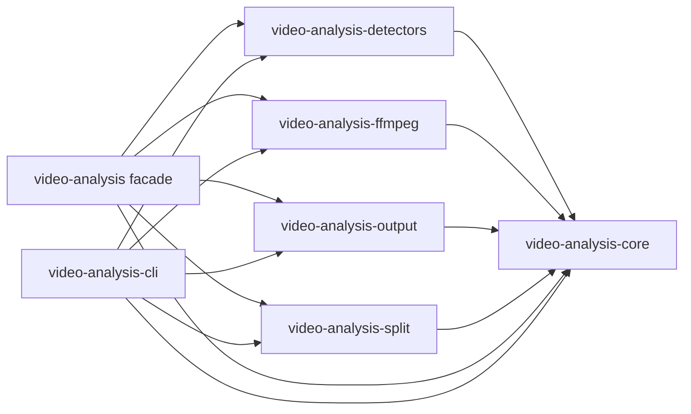

# Rust Video Analysis Packages

This workspace contains a Rust-first reimplementation of PySceneDetect-style video scene analysis.
The vendored `references/pyscenedetect` directory is used only as an upstream behavior reference.

## Crates

- `video-analysis`: umbrella re-export crate.
- `video-analysis-core`: timecodes, frames, scene types, metrics, detector trait, and pipeline.
- `video-analysis-detectors`: content, adaptive, threshold, histogram, and perceptual hash detectors.
- `video-analysis-ffmpeg`: FFmpeg-backed raw RGB video source.
- `video-analysis-output`: scene/stats CSV and simple HTML output helpers.
- `video-analysis-split`: ffmpeg CLI based scene splitting.
- `video-analysis-cli`: `vanalyze` command-line tool.

## Dependency Graph

`video-analysis-core` is the foundational crate for shared contracts and pipeline
orchestration. Functional crates depend on `core`, but not on each other.
Composition happens in `video-analysis-cli` and the root `video-analysis` facade
crate.



## Functional Pipelines

### Detection

```text
video-analysis-ffmpeg
  -> VideoSource / OwnedVideoFrame
  -> video-analysis-core::ScenePipeline
  -> video-analysis-detectors::SceneDetector impls
  -> video-analysis-core::DetectionResult
```

- `video-analysis-ffmpeg` decodes/probes input videos and yields frames.
- `video-analysis-core` owns frame, time, scene, result, and orchestration types.
- `video-analysis-detectors` implements scene detector algorithms.
- `video-analysis-cli` wires the source, detector choice, and pipeline execution.

### Output

```text
DetectionResult
  -> video-analysis-output
  -> CSV / HTML / stdout / file writers
```

- `video-analysis-output` serializes `Scene`, `MetricsStore`, and
  `DetectionResult`.
- It must not know about FFmpeg, CLI options, or detector implementations.

### Split

```text
DetectionResult.scenes
  -> video-analysis-split
  -> ffmpeg CLI scene files
```

- `video-analysis-split` consumes only `Scene` values and splits the original
  media.
- It does not perform detection or own detector/source selection.

### CLI

```text
CLI args
  -> source construction
  -> detector construction
  -> ScenePipeline::detect
  -> output or split action
```

- `video-analysis-cli` composes all runtime pieces.
- The CLI owns command selection, argument mapping, and workflow branching.

## Dependency Rules

Allowed internal dependencies:

- `video-analysis-core`: external utility crates only.
- `video-analysis-detectors` -> `video-analysis-core`.
- `video-analysis-ffmpeg` -> `video-analysis-core`.
- `video-analysis-output` -> `video-analysis-core`.
- `video-analysis-split` -> `video-analysis-core`.
- `video-analysis-cli` -> all functional crates.
- `video-analysis` root facade -> all library crates except CLI.

Forbidden internal dependencies:

- `video-analysis-core` must not depend on any workspace crate.
- `video-analysis-detectors` must not depend on FFmpeg, output, split, CLI, or
  facade crates.
- `video-analysis-ffmpeg` must not depend on detectors, output, split, CLI, or
  facade crates.
- `video-analysis-output` must not depend on detectors, FFmpeg, split, CLI, or
  facade crates.
- `video-analysis-split` must not depend on detectors, FFmpeg crate, output,
  CLI, or facade crates.
- No library crate should depend on `video-analysis-cli`.

## Example

```bash
cargo run -p video-analysis-cli -- detect --input video.mp4 --detector content --output scenes.csv --stats stats.csv
cargo run -p video-analysis-cli -- list --input video.mp4 --detector adaptive
cargo run -p video-analysis-cli -- split --input video.mp4 --detector content --output-dir scenes
```

The default test suite does not require FFmpeg to be installed.
