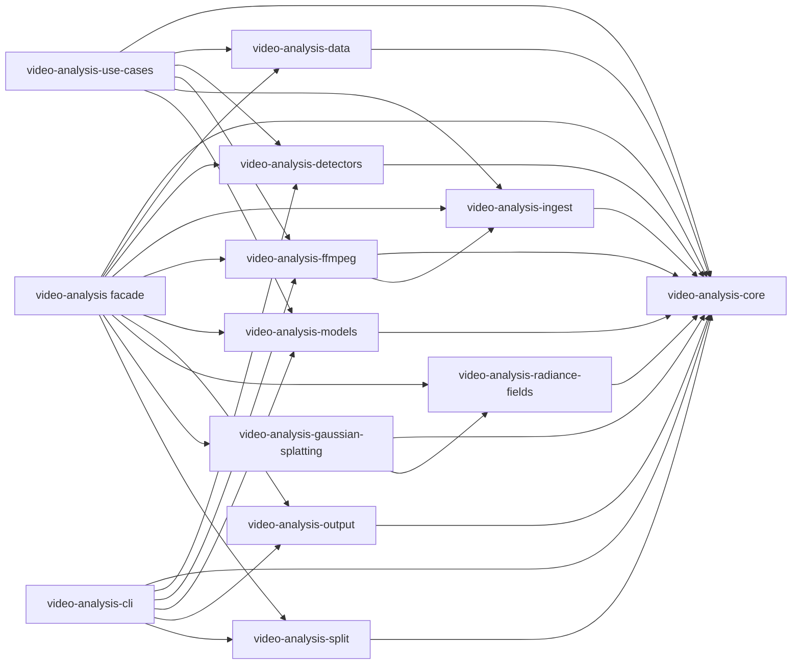

# Rust Video Analysis Packages

This workspace contains a Rust-first reimplementation of PySceneDetect-style video scene analysis.
The vendored `references/pyscenedetect` directory is used only as an upstream behavior reference.

## Crates

- `video-analysis`: umbrella re-export crate.
- `video-analysis-core`: timecodes, video/audio/text sample types, metrics, analyzer traits, observations, and realtime pipelines.
- `video-analysis-data`: stream record normalization plus online aggregation and
  bucketing for video, audio, text, numeric, and vector data.
- `video-analysis-detectors`: content, adaptive, threshold, histogram, and perceptual hash detectors.
- `video-analysis-ingest`: media ingest traits plus live/file text sources.
- `video-analysis-ffmpeg`: FFmpeg-backed video and audio ingest implementations.
- `video-analysis-models`: Hugging Face model downloads plus normalized model
  adapter contracts for object, scene, and text/semantic analyzers.
- `video-analysis-radiance-fields`: camera, ray, grid, and volume rendering
  contracts for radiance-field style scene representations.
- `video-analysis-gaussian-splatting`: 3D Gaussian primitive validation,
  projection, sorting, and CPU compositing helpers for Gaussian splatting.
- `video-analysis-output`: scene/stats CSV and simple HTML output helpers.
- `video-analysis-split`: ffmpeg CLI based scene splitting.
- `video-analysis-cli`: `vanalyze` command-line tool.
- `video-analysis-use-cases`: runnable end-to-end use-case pipelines.
- `@video-analysis/ui`: React + TailwindCSS component packs for viewing
  analysis results in an application UI.

## Frontend Component Packs

The `packages/video-analysis-ui` npm package mirrors the Rust package
boundaries with subpath exports:

- `@video-analysis/ui/core`: scene timelines, scene tables, observations,
  audio/text events, and video summary cards.
- `@video-analysis/ui/cli`: command status, arguments, and generated output
  file summaries for `vanalyze` workflows.
- `@video-analysis/ui/data`: bucket and stream summary views.
- `@video-analysis/ui/detectors`: detection and cut summary views.
- `@video-analysis/ui/ffmpeg`: media metadata panels.
- `@video-analysis/ui/ingest`: source and asset summaries.
- `@video-analysis/ui/models`: capability and scored model observation views.
- `@video-analysis/ui/output`: report shell and JSON report loader.
- `@video-analysis/ui/split`: scene split plan preview.
- `@video-analysis/ui/use-cases`: composed dashboards, including
  `YoutubeVideoReportView` for the YouTube video use-case JSON report.
- `@video-analysis/ui`: the root facade that re-exports all frontend packs.

```tsx
import { YoutubeVideoReportView } from "@video-analysis/ui/use-cases";
import type { YoutubeVideoReport } from "@video-analysis/ui";

export function ReportPage({ report }: { report: YoutubeVideoReport }) {
  return <YoutubeVideoReportView report={report} />;
}
```

Add the package output to Tailwind's content list:

```js
import videoAnalysisContent from "@video-analysis/ui/tailwind-content";

export default {
  content: ["./src/**/*.{ts,tsx}", ...videoAnalysisContent],
};
```

## Use-Case Website

`packages/video-analysis-web` is a Vite React app for trying the available
use-case workflows and viewing generated reports with the component packs.

```bash
bun install
bun run ui:build
bun run web:dev
```

The app includes the YouTube video use case, a command builder for
`video-analysis-use-cases`, sample report data, JSON report loading, and
dashboard views for scenes, observations, transcript, events, buckets, and split
plans.

## Workspace Checks

Run the full local verification baseline before publishing changes:

```bash
scripts/check.sh
```

The script runs Rust tests, strict clippy, and the UI/web production builds.
FFmpeg decode coverage is intentionally opt-in so the default suite stays
hermetic:

```bash
cargo test -p video-analysis-ffmpeg --features ffmpeg-tests
```

## Dependency Graph

`video-analysis-core` is the foundational crate for shared contracts and pipeline
orchestration. Most functional crates depend on `core`, while
`video-analysis-gaussian-splatting` also reuses the camera and geometry contracts
from `video-analysis-radiance-fields`. Composition happens in
`video-analysis-cli` and the root `video-analysis` facade crate.

For the inter-package API contracts, serialized report shapes, package exports,
and compatibility rules, see [API Contracts](docs/API_CONTRACTS.md).



## Functional Pipelines

### YouTube Video Use Case

The `video-analysis-use-cases` crate contains runnable composition examples.
The first pipeline downloads or accepts a YouTube video, detects scenes,
extracts/segments transcript text, performs simple audio activity detection,
aggregates video/audio/text records into data buckets, and can call external
model commands for object/person detection, OCR, and transcript text analysis.

```bash
cargo run -p video-analysis-use-cases -- youtube-video \
  --url "https://www.youtube.com/watch?v=..." \
  --output use-case-output/youtube-video/analysis.json
```

Required local tools for the full URL workflow are `yt-dlp`, `ffmpeg`, and
`ffprobe`. Transcription is skipped unless the OpenAI Whisper CLI is available
as `whisper`, or a command is supplied explicitly:

```bash
cargo run -p video-analysis-use-cases -- youtube-video \
  --url "https://www.youtube.com/watch?v=..." \
  --transcriber-command whisper \
  --transcriber-arg --model \
  --transcriber-arg base
```

Vision and text model integrations use the `video-analysis-models`
`ExternalCommandModel` JSON protocol. Each command receives one JSON request on
stdin and returns `{"predictions":[...]}` on stdout.

```bash
cargo run -p video-analysis-use-cases -- youtube-video \
  --input ./video.mp4 \
  --object-command ./scripts/detect-objects \
  --ocr-command ./scripts/ocr-frame \
  --text-command ./scripts/analyze-transcript \
  --visual-sample-every 30
```

The output report includes local asset paths, scenes, observations, transcript
segments, audio events, text events, and data bucket summaries.

### Video Detection

```text
video-analysis-ffmpeg
  -> video-analysis-ingest::VideoFrameSource / MediaSource
  -> video-analysis-core::OwnedVideoFrame
  -> video-analysis-core::ScenePipeline
  -> video-analysis-detectors::SceneDetector impls
  -> video-analysis-core::DetectionResult
```

- `video-analysis-ffmpeg` decodes/probes input videos and yields video frames.
- `video-analysis-ingest` defines file/live source traits for video, audio, and
  text.
- `video-analysis-core` owns video/audio/text sample types, time, scene, result,
  observation, analyzer trait, and pipeline orchestration contracts.
- `video-analysis-detectors` implements scene detector algorithms.
- `video-analysis-cli` wires the source, detector choice, and pipeline execution.

### Realtime Ingest

`ScenePipeline` supports both batch and incremental processing:

```rust
use video_analysis_core::{Result, ScenePipeline};
use video_analysis_detectors::ContentDetector;
use video_analysis_ffmpeg::FfmpegVideoSource;
use video_analysis_ingest::VideoFrameSource;

fn main() -> Result<()> {
    let mut source = FfmpegVideoSource::open_live("rtsp://camera.example/stream")?;
    let mut pipeline = ScenePipeline::builder()
        .detector(ContentDetector::default())
        .start_in_scene(true)
        .build()?;

    while let Some(frame) = source.next_video_frame()? {
        let analysis = pipeline.process_frame(frame)?;
        for cut in analysis.cuts {
            println!("cut at {:.3}s", cut.position.timestamp.seconds());
        }
    }

    let _final_result = pipeline.finish_detection()?;
    Ok(())
}
```

For recorded sources, `ScenePipeline::detect(&mut source)` remains available.
For realtime sources, call `process_frame()` as frames arrive and only call
`finish_detection()` when the stream ends or the application shuts down.

### Realtime Video Enrichment

Scene detection and frame-level enrichment can run in one pass over a live
video stream. OCR, face recognition, object detection, and similar integrations
implement `VideoAnalyzer` and emit structured `Observation` values.

```rust
use video_analysis_core::{Observation, ObservationKind, RealtimeVideoPipeline, Result, VideoAnalyzer, VideoFrame};
use video_analysis_detectors::ContentDetector;
use video_analysis_ffmpeg::FfmpegVideoSource;
use video_analysis_ingest::VideoFrameSource;

struct OcrAnalyzer;

impl VideoAnalyzer for OcrAnalyzer {
    fn name(&self) -> &str {
        "ocr"
    }

    fn process_frame(&mut self, frame: &VideoFrame<'_>) -> Result<Vec<Observation>> {
        let _ = frame;
        Ok(vec![Observation::new(self.name(), ObservationKind::Text)
            .text("detected text")
            .score(0.95)])
    }
}

fn main() -> Result<()> {
    let mut source = FfmpegVideoSource::open_live("rtsp://camera.example/stream")?;
    let mut pipeline = RealtimeVideoPipeline::builder()
        .scene_detector(ContentDetector::default())
        .video_analyzer(OcrAnalyzer)
        .start_in_scene(true)
        .build()?;

    while let Some(frame) = source.next_video_frame()? {
        let analysis = pipeline.process_frame(frame)?;

        for observation in analysis.observations {
            println!("scene {:?}: {:?}", observation.scene_index, observation.kind);
        }

        for scene in analysis.completed_scenes {
            println!(
                "closed scene {} with {} observations",
                scene.scene_index,
                scene.observations.len()
            );
        }
    }

    let result = pipeline.finish_analysis()?;
    println!("{} scenes, {} observations", result.scenes.len(), result.observations.len());
    Ok(())
}
```

`RealtimeVideoPipeline` decodes each frame once, feeds the borrowed frame to
scene detectors and video analyzers, annotates observations with the active
scene index, and emits a `SceneAnalysis` as soon as a scene closes. Downstream
components can consume either frame events immediately or complete per-scene
batches. OCR observations can also be converted to `OwnedTextSegment` with
`Observation::to_text_segment(...)` when a text pipeline should process detected
on-screen text.

### Hugging Face Model Downloads and Normalization

Common Hugging Face models can be downloaded into the local Hugging Face cache:

```bash
vanalyze models presets
vanalyze models download --preset detr-resnet-50
vanalyze models download --preset distilbert-sst2
```

Custom repositories are also supported when the files are known:

```bash
vanalyze models download \
  --repo-id hf-internal-testing/tiny-random-distilbert \
  --task text-classification \
  --file config.json \
  --file tokenizer.json
```

The `video-analysis-models` crate keeps model-specific inference behind small
backend traits:

```rust
use video_analysis_core::{Result, VideoAnalysisPipeline};
use video_analysis_models::{
    HuggingFaceDownloader, HuggingFaceModelSpec, ModelPreset, ModelVideoAnalyzer,
    VisionModelBackend,
};

# fn build_backend() -> impl VisionModelBackend { unimplemented!() }
fn main() -> Result<()> {
    let spec = HuggingFaceModelSpec::from_preset(ModelPreset::DetrResnet50);
    let downloaded = HuggingFaceDownloader::new().download(&spec)?;

    let backend = build_backend(); // ONNX, Candle, Python transformers, etc.
    let analyzer = ModelVideoAnalyzer::new(downloaded.spec.name, backend);
    let _pipeline = VideoAnalysisPipeline::builder().analyzer(analyzer).build()?;
    Ok(())
}
```

Backends return `RawPrediction` values and the models crate repairs and
normalizes common API differences: `xywh` or `xyxy` boxes, normalized or pixel
coordinates, missing labels, minimum score filtering, and same-label
non-maximum suppression. `ModelVideoAnalyzer` emits core `Observation` values;
`ModelTextAnalyzer` emits core `AnalysisEvent` values with dynamic semantic
labels.

For model APIs that do not have a native Rust runtime yet, `ExternalCommandModel`
passes a JSON request to any executable over stdin and expects normalized JSON
predictions on stdout. This makes Python `transformers`, ONNX Runtime helpers,
or service-specific CLIs usable while keeping the package API stable.

### Audio Analysis

Audio follows the same shape: the FFmpeg crate decodes, the ingest trait yields
chunks, and `AudioPipeline` analyzes each chunk as it arrives.

```rust
use video_analysis_core::{AudioPipeline, Result};
use video_analysis_ffmpeg::FfmpegAudioSource;
use video_analysis_ingest::AudioFrameSource;

fn main() -> Result<()> {
    let mut source = FfmpegAudioSource::open_live("rtsp://camera.example/stream")?;
    let mut pipeline = AudioPipeline::builder()
        .analyzer(my_audio_analyzer())
        .build()?;

    while let Some(frame) = source.next_audio_frame()? {
        let analysis = pipeline.process_frame(frame)?;
        for event in analysis.events {
            println!("{:?} {}", event.timestamp, event.label);
        }
    }

    let _final_result = pipeline.finish_analysis()?;
    Ok(())
}
```

Audio analyzers implement `video_analysis_core::AudioAnalyzer` and receive
borrowed `AudioFrame` values. `FfmpegAudioSource` emits `f32` PCM chunks by
default, with configurable samples per chunk.

### Text Analysis

Text ingest is line/segment oriented so transcripts, subtitles, logs, or live
ASR output can be analyzed incrementally.

```rust
use video_analysis_core::{Result, TextPipeline};
use video_analysis_ingest::{TextLineSource, TextSegmentSource};

fn main() -> Result<()> {
    let mut source = TextLineSource::open("transcript.txt")?;
    let mut pipeline = TextPipeline::builder()
        .analyzer(my_text_analyzer())
        .build()?;

    while let Some(segment) = source.next_text_segment()? {
        let analysis = pipeline.process_segment(segment)?;
        for event in analysis.events {
            println!("segment {} {}", analysis.segment_index, event.label);
        }
    }

    let _final_result = pipeline.finish_analysis()?;
    Ok(())
}
```

Text analyzers implement `video_analysis_core::TextAnalyzer`. For live text,
wrap any blocking `BufRead` with `TextLineSource::live(...)`.

### Data Aggregation

Large video, audio, text, numeric, and vector streams can be normalized into
borrowed `DataRecord` values and summarized online without retaining the
original payloads.

```rust
use video_analysis_core::{Result, Timestamp, Timebase};
use video_analysis_data::{BucketAggregator, BucketConfig, DataRecord};

fn main() -> Result<()> {
    let config = BucketConfig::fixed_duration_seconds(5.0)?;
    let mut buckets = BucketAggregator::new(config)?;

    let timestamp = Timestamp::new(12, Timebase::new(1, 1));
    for bucket in buckets.push(DataRecord::number(
        "telemetry:score",
        0,
        Some(timestamp),
        0.82,
    ))? {
        println!("closed bucket {} with {} records", bucket.bucket_index, bucket.records);
    }

    let embedding = [0.1, 0.2, 0.3];
    buckets.push(DataRecord::vector(
        "telemetry:embedding",
        1,
        Some(timestamp),
        &embedding,
    ))?;

    let _tail = buckets.finish();
    Ok(())
}
```

Buckets can be fixed by duration, record count, or estimated byte size. Numeric
streams keep online min/max/mean summaries. Vector streams keep norm summaries
and bounded per-dimension means so embeddings can be handled without storing
every vector.

### Output

```text
DetectionResult
  -> video-analysis-output
  -> CSV / HTML / stdout / file writers
```

- `video-analysis-output` serializes `Scene`, `MetricsStore`, and
  `DetectionResult`.
- It must not know about FFmpeg, CLI options, or detector implementations.

### Split

```text
DetectionResult.scenes
  -> video-analysis-split
  -> ffmpeg CLI scene files
```

- `video-analysis-split` consumes only `Scene` values and splits the original
  media.
- It does not perform detection or own detector/source selection.

### CLI

```text
CLI args
  -> source construction
  -> detector construction
  -> ScenePipeline::detect
  -> output or split action
```

- `video-analysis-cli` composes all runtime pieces.
- The CLI owns command selection, argument mapping, and workflow branching.

## Dependency Rules

Allowed internal dependencies:

- `video-analysis-core`: external utility crates only.
- `video-analysis-data` -> `video-analysis-core`.
- `video-analysis-detectors` -> `video-analysis-core`.
- `video-analysis-ingest` -> `video-analysis-core`.
- `video-analysis-ffmpeg` -> `video-analysis-core`, `video-analysis-ingest`.
- `video-analysis-output` -> `video-analysis-core`.
- `video-analysis-split` -> `video-analysis-core`.
- `video-analysis-cli` -> crates it composes for CLI workflows.
- `video-analysis` root facade -> all library crates except CLI.

Forbidden internal dependencies:

- `video-analysis-core` must not depend on any workspace crate.
- `video-analysis-detectors` must not depend on FFmpeg, output, split, CLI, or
  facade crates.
- `video-analysis-data` must not depend on detectors, FFmpeg, output, split,
  CLI, or facade crates.
- `video-analysis-ingest` must not depend on detectors, FFmpeg, output, split,
  CLI, or facade crates.
- `video-analysis-ffmpeg` must not depend on detectors, output, split, CLI, or
  facade crates.
- `video-analysis-output` must not depend on detectors, FFmpeg, split, CLI, or
  facade crates.
- `video-analysis-split` must not depend on detectors, FFmpeg crate, output,
  CLI, or facade crates.
- No library crate should depend on `video-analysis-cli`.

## Example

```bash
cargo run -p video-analysis-cli -- detect --input video.mp4 --detector content --output scenes.csv --stats stats.csv
cargo run -p video-analysis-cli -- detect --input video.mp4 --detectors content,adaptive,histogram,hash --combined-threshold 0.5 --detector-weight histogram=0.75 --detector-weight hash=0.75 --output scenes.csv --stats stats.csv
cargo run -p video-analysis-cli -- list --input video.mp4 --detector adaptive
cargo run -p video-analysis-cli -- split --input video.mp4 --detector content --output-dir scenes
```

The default test suite does not require FFmpeg to be installed.
